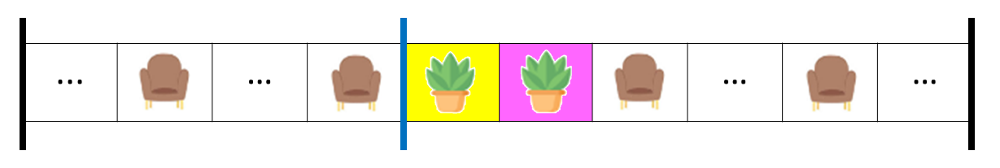
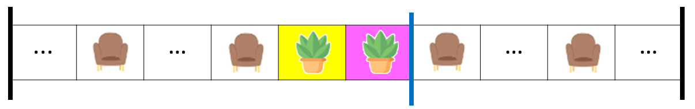
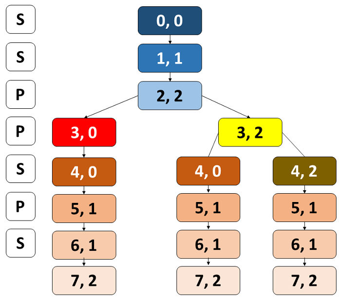

## Overview
In this problem, we are supposed to divide the corridor which contains seats (encoded by S) and plants (encoded by P).

The division should produce non-overlapping sections such that each section contains exactly two S. There is no restriction on the number of P in each section, which offers flexibility to shift the divider.

Flexibility provided by P produces different ways to perform the division.

We are supposed to count the number of ways to divide the corridor, and then return the count modulo 1000000007. Moreover, if there is no way to divide the corridor, we should return 0.

Let's try to filter out cases when the task is not possible, based on the number of S and P in the corridor.

if we have 0 seat, then we can't divide the corridor, because no section can contain exactly two S.

if we have only 1 seat, then we can't divide the corridor, because no section can contain exactly two S.

if we have only 2 seats, then we can divide the corridor, but in only one way, because there is only one way to divide the corridor into two sections, each containing exactly two S.

twoS

The ... in the illustration above represents any number of P (including 0) in the corridor.

The only way is to use the existing installed end-divider so that each section contains exactly two S. If we shift any of these dividers or install a new divider, then we will end up with a section containing less than two S.

if we have only 3 seats, then again, we can't divide the corridor, because no division is such that each section contains exactly two S. There will be at least one section containing less than two S.

Let's examine one more case before generalizing the above observations. If we have 4 seats, then we can divide the corridor. Let's focus on the illustration to understand the division.

fourS

The ... in the illustration above represents any number of P (including 0) in the corridor.

We can have only one divider between the second and third S. Now, the number of ways we can have this divider certainly depends on the number of P between the second and third S.

fourS

If there is 0 P between the second and third S, then we can have only one way of installing the divider.

fourSzeroP

If there is 1 P between the second and third S, then we can have two ways of installing the divider. Note that out of these two blue bars, we will select only one in one division. Thus, there are two different ways in this example, with one divider!

fourSoneP

If there are 2 P between the second and third S, then we can have three ways of installing the divider. Again, more precisely, there are three different ways in this example, with one divider!

fourStwoP

In general,

"If there are k P between second and third S, then we can have k+1 ways of installing the divider"

In other words, we can say that

"If the index of second S is i and the index of third S is j, then we can have j-i ways of installing the divider"

Based on the above observations, we can generalize the following facts.

"No seats, or odd number of seats in the corridor implies that there is no way to divide the corridor"

The contrapositive of every implication is also true. Thus, we can say that

"If there is a way to divide the corridor, then there will be seats in the corridor, and the number of seats will be even"

Readers can appreciate that the converse of the fact is also true.

"If there is no way to divide the corridor, then there will be no seats, or odd number of seats in the corridor."

Moreover, the contrapositive of this converse, like every other contrapositive, is also true. Thus, we can say that

"If there are seats in the corridor, and the number of seats is even, then there will be a way to divide the corridor"

The number of plants does not determine the presence of a dividing way. However, the number of plants, if there is a dividing way, will determine the number of different methods of installing the divider.

We can also emphasize that the pair of a given seat S is fixed (provided there is a way to divide the corridor). This can be illustrated as

the first S will always be paired with the second S

the second S will always be paired with the first S. If it has another neighbor, the third S, then also it will be paired with the first S only. We can't leave the first S unpaired because each section should contain exactly two S.

the third S will always be paired with the fourth S

the fifth S will always be paired with the sixth S

and so on...

We can only install a divider between two S that are "neighbors, but not paired", and plants in between them offer flexibility to install the divider in different ways.

The number of plants between paired seats doesn't offer any facility to install the divider.

The first S and the second S are paired neighbors. The plants in between them offer any facility to install the divider.
The second S and the third S are "neighbors, but not paired". The plants in between them offer flexibility to install the divider in different ways.
The first S and the third S are not neighbors.
Similarly, the number of plants between the pre-installed divider and the first seat (or the last seat and the pre-installed divider) doesn't offer any facility to install the divider.

Now, let's focus on the phrase

Since the answer may be very large, return it modulo 1000000007.

Since we need to deal with modular arithmetic, the section lists important properties of modular arithmetic. If readers are not familiar with these properties, they are encouraged to expand the section by clicking here.

↓ 
Section after propeties of modular arithmetic
​
 

With a few important facts being established, let's move on to the solution.

## Approach 1: Top-Down Dynamic Programming

### Intuition

Let's try to count the number of ways to divide the `corridor`, by analyzing the arrangement of `S` and `P` from left to right. We will put weight on the fact that

> "Plants P offer flexibility to install the divider in different ways".

Let's analyze this with three different ways to install the divider when there were 4 S in the corridor, and two P in between the second and third S.

In this case, the yellow plant took the responsibility of installing the divider after confirming that two S are there in the section.



In this case, the yellow plant passes the baton to the next index. 
The pink plant took the responsibility of installing the divider after confirming that two S were there in the section.


In this case, the pink plant passed after receiving the baton from the yellow plant again passed the baton to the next index. 
The next index is a seat, and in fact, the third S, thus it cannot be part of the received baton's section. 
Thus, it installed the divider after realizing that there were already two S in the section.



Thus, every plant, in general, has two options after realizing that there are two S in the growing section. 
These options produce different ways to divide the corridor.

Initially, we have a pre-installed divider before index 0, and we are in the first section, which we can close only when we find a pair of S while scanning from left to right.

Thus, for formulating, let's use

- `index` to denote the index of the current element in the corridor, and
- seats to denote the number of S in the current section. The seats can take only a limited number of values.
    - 0 if there is no S in the current section
    - 1 if there is only one S in the current section
    - 2 if there are two S in the current section.
        - if we close the section here, it means that for the next section, we will have 0 S remaining.

        - if we don't close, then we can keep growing the section until we find another S, then the moment we find more than two S in the current section, we have to start a new section, and the S in the new section will be 1.

        Thus, because of formulation, we can say that the seats can take only three values, 0, 1, and 2.

Thus, with these notations, let's try to compute the number of ways to divide the corridor as a function of index and seats.

More precisely, we will define a function `count(index, seats)` to denote the number of ways to divide the `corridor` starting from index `index` to the last index, with `seats` number of `S` in the current section.

- if `index` reaches n (the `corridor.length()`), then the current section is valid only if `seats == 2`.

    Thus, if index == n, we can return 1 if seats == 2, otherwise we can return 0. 
    This additional 1 implies that we have found a valid way to divide the corridor. 
    We will ensure not to count the same way again, by ensuring that the (i1, s1) pair calls count(i2, s2) not more than once.

- now if we are on a valid index, and the number of seats in the current sections is exactly 2, then we either can close the section, or we can keep growing the section. It depends on whether corridor[index] is S or P.

    - if `corridor[index]` is S, then we have to close the section and start a new section from this index. Thus, we need to call count for the next index, with seats = 1. Hence, return count(index + 1, 1)

    - if `corridor[index]` is P, then we have two options, and both of these options will generate different ways to divide the corridor.

        - *close the section*: then at the next index, we will have `seats = 0`.
        - *keep growing the section*: then at the next index, we will have `seats = 2` only.

        Hence, return count(index + 1, 0) + count(index + 1, 2)

- lastly, if we are on a valid index, but number of seats in the current section is less than 2, then we don't have any option but to keep growing the section.

    - if corridor[index] is S, the number of seats in the section will be incremented. Hence, return count(index + 1, seats + 1)

    - if corridor[index] is P, then return count(index + 1, seats)

We would call count(0, 0) to compute the number of ways to divide the corridor starting from index 0 to the last index, with 0 number of S in the current section.

Now, we can see that the function count is a recursive function. There might be a case when one sub-problem is called multiple times. The following tree illustrates one such case for corridor as "SSPPSPS"



The same color-coded rectangles denote the same sub-problems. In general, we call two sub-problems when corridors[index] == P and seats == 2

At (2, 2) we call (3, 0) to close the section, and (3, 2) to keep growing the section.

At (3, 0) we call (4, 0) to grow the section. We can't close the section because we have 0 S in the current section.
At (3, 2) we call (4, 0) to close the section, and (4, 2) to keep growing the section.
Thus, we can see that (4, 0) is called twice.

Although we might call the same sub-problem multiple times, we aren't double counting the same way to divide the corridor. The count is incremented at the leaf nodes, and the leaf nodes with seats == 2 represent a unique way to divide the corridor.

Still, computing these overlapping sub-problems again and again is not efficient.

**What if we store the result of each sub-problem and use it when required?** 
This is what we do in dynamic programming. 
We store the result of each sub-problem and use it when required. 
Thus, instead of solving the same sub-problem again and again, we can store the result of each sub-problem and use it whenever required.

> Dynamic programming is a programming paradigm in which we break a problem into sub-problems store the result of each sub-problem and use it when required. 
> To dive deep into dynamic programming, readers can visit Dynamic Programming Explore Card.

Since there are two state variables index and seats, we can use a two-dimensional array (or a hash map) to store the result of each sub-problem.

> If there are T state variables, then we need an array of at most T dimensions to store the result of each sub-problem.

**What will be the size of the array?** 
The size of the array will be the range of each state variable.

- index can take values from 0 to n - 1, where n is the length of the corridor. Thus, there can be n rows in the memoization array. index == n is the base case, and need not be stored in the memoization array.
- seats can take values from 0 to 2. Thus, there can be 3 columns in the memoization array.

There is no hard-and-fast rule to use a two-dimensional array. We may use a hash map to cache the result of each sub-problem. 
The key of the hash map would be the pair (index, seats), and the value would be the result of the sub-problem.

Readers are encouraged to implement the solution on their own. 
Make sure to take modulo 1000000007 while storing the result in the cache array. 
We will exploit properties of modular arithmetic as discussed in the overview section.

### Algorithm
1. Store 1000000007 in the variable MOD for convenience. It is a good practice to store constants.

2. Initialize a two-dimensional array cache of size n rows and 3 columns. Initialize each element of the array to -1. We will use this array to cache the result of each sub-problem. Alternatively, we can use a hash map to cache the result of each sub-problem.

3. Define a function count which takes two arguments index and seats. It can have other arguments as well to access the required variables.

    - If index is equal to n, then the current section is valid only if seats is equal to 2. Thus, return 1 if seats == 2, otherwise return 0.

    - If cache[index][seats] is not equal to -1, then return cache[index][seats]. This implies that we have already computed the result of this sub-problem, and we can return the cached result.

    - If the current section has seats == 2

        - If corridor[index] is S, then we have to close the section and start a new section from this index. Thus, return count(index + 1, 1)
        - If corridor[index] is P, then we have the option to close or to keep growing the section. Thus, return (count(index + 1, 0) + count(index + 1, 2)) % MOD
         
    - If the current section has seats < 2, then we have to keep growing the section.

        - If corridor[index] is S, then return count(index + 1, seats + 1)
        - If corridor[index] is P, then return count(index + 1, seats)

4. Call the function `count` with `index = 0` and `seats = 0`. Return the result of the function call.

### Implementation

```python
class Solution:
    def numberOfWays(self, corridor: str) -> int:
        # Store 1000000007 in a variable for convenience
        MOD = 1_000_000_007

        # Cache the result of each sub-problem
        cache = [[-1] * 3 for _ in range(len(corridor))]

        # Count the number of ways to divide from "index" to the last index
        # with "seats" number of "S" in the current section
        def count(index, seats):
            # If we have reached the end of the corridor, then
            # the current section is valid only if "seats" is 2
            if index == len(corridor):
                return 1 if seats == 2 else 0

            # If we have already computed the result of this sub-problem,
            # then return the cached result
            if cache[index][seats] != -1:
                return cache[index][seats]
            
            # If the current section has exactly 2 "S"
            if seats == 2:
                # If the current element is "S", then we have to close the
                # section and start a new section from this index. Next index
                # will have one "S" in the current section
                if corridor[index] == "S":
                    result = count(index + 1, 1)
                else:
                    # If the current element is "P", then we have two options
                    # 1. Close the section and start a new section from this index
                    # 2. Keep growing the section
                    result = (count(index + 1, 0) + count(index + 1, 2)) % MOD
            else:
                # Keep growing the section. Increment "seats" if present
                # element is "S"
                if corridor[index] == "S":
                    result = count(index + 1, seats + 1)
                else:
                    result = count(index + 1, seats)
            
            # Memoize the result, and return it
            cache[index][seats] = result
            return cache[index][seats]
        
        # Call the count function
        return count(0, 0)
```

1. The Python, C, and C++ implementation uses a two-dimensional array. The Java and JavaScript implementation uses a hash map.

2. In the cache, we will store the result, which is less than 1000000007. Now, when we are adding two such results (in the case when corridors[index] == P and seats == 2), then we need to take modulo 1000000007 again because the sum of two numbers less than 1000000007 can be greater than 1000000007.

It's worth noting that the sum of two numbers less than 1000000007 can be at most 2000000012 which is less than INT_MAX. Hence, we need not to worry about overflow when only two numbers are added.

### Complexity Analysis

Let N be the length of the corridor.

- Time complexity: O(N)

    We are calling the function count for each index with constant three possible values of seats. Thus, there will be at most 3N function calls. Each function call computes the result in constant time. Thus, the time complexity will be O(3N)⋅O(1), which is O(N).

- Space complexity: O(N)

    We are using a two-dimensional array of size N×3 to cache the result of each sub-problem. Thus, the space complexity will be O(N⋅3), which is O(N).

## Approach 2: Bottom-up Dynamic Programming

### Intuition
Let's transform the recursive solution into an iterative solution.

For this let's write the mathematical recurrence for the problem.

count(index,seats) represents the number of ways to divide the corridor starting from index index to the last index, with seats number of S in the current section. The equation for the recurrence (which is often called the Bellman equation) is

count(index,seats)= 
⎩
⎨
⎧
​
  
1
0
count(index+1,1)
count(index+1,0)+count(index+1,2)
count(index+1,seats+1)
count(index+1,seats)
​
  
if index=corridor.length and seats=2
if index=corridor.length and seats<2
if seats=2 and corridor[index]=S
if seats=2 and corridor[index]=P
if seats<2 and corridor[index]=S
if seats<2 and corridor[index]=P
​
 

Let's break this recurrence for every possible value of seats separately. Thus, we can have the following three recurrences.

count(index,0)= 
⎩
⎨
⎧
​
  
0
count(index+1,1)
count(index+1,0)
​
  
if index=corridor.length
if corridor[index]=S
if corridor[index]=P
​
 

count(index,1)= 
⎩
⎨
⎧
​
  
0
count(index+1,2)
count(index+1,1)
​
  
if index=corridor.length
if corridor[index]=S
if corridor[index]=P
​
 

count(index,2)= 
⎩
⎨
⎧
​
  
1
count(index+1,1)
count(index+1,0)+count(index+1,2)
​
  
if index=corridor.length
if corridor[index]=S
if corridor[index]=P
​
 

Since there are two state variables index and seats, we can use a two-dimensional array to store the result of each sub-problem.

Our agenda is to fill the array in a bottom-up fashion. We will start from the base case and then fill the array for the remaining sub-problems.

We will traverse from the last index, and fill the array for each possible value of seats at each index.

If index = corridor.length, then as per three recurrences,

count[index][0] = 0

count[index][1] = 0

count[index][2] = 1

otherwise,

if corridor[index] is S, then as per three recurrences,

count[index][0] = count[index + 1][1]

count[index][1] = count[index + 1][2]

count[index][2] = count[index + 1][1]

if corridor[index] is P, then as per three recurrences,

count[index][0] = count[index + 1][0]

count[index][1] = count[index + 1][1]

count[index][2] = count[index + 1][0] + count[index + 1][2]

As discussed in implementation note of Approach-1, we need to take modulo 1000000007 while saving count[index][2] in the actual implementation.

This completes the filling of the array. The result will be stored in count[0][0], number of ways to divide the corridor starting from index 0 to the last index, with 0 number of S in the current section.

Moreover, we also get hints about the dimension of the count array. index can take values from 0 to N (where N = corridor.length), and seats can take values from 0 to 2. Thus, the dimensions of the array will be (N+1)×3.

In the top-down approach, the cache was of size N×3. This is because we were not storing the case when index = N. In that case, we were returning without storing. In the bottom-up approach, we are storing the result for the case when index = N. Thus, we need to increase the size of the array by one row.

It's worth noting that it is bottom-up because we are moving from the solved base case to the unsolved sub-problems.

The order of traversal from bottom-row to up has nothing to do with the term bottom-up dynamic programming. Many problems require traversal in a diagonal manner. Thus, critically analyze the Bellman Equation to conclude the order of filling the array.

In this particular problem, readers can appreciate that because of symmetry in defining count, we can move from top-row to bottom as well.

our definition of count is that it denotes the number of ways to divide the corridor starting from index index to last index, with seats number of S in the current section.
we can define count as the number of ways to divide the corridor starting from index index to first index, with seats number of S in the current section. The index < 0 will be the base case in this definition.
Hence, we can see that

Filling from the bottom row to the top can be interpreted as scanning the corridor from left to right
Filling from top-row to bottom can be interpreted as scanning the corridor from right to left.
Both are symmetric, and we can use either of them.

Readers are encouraged to implement the solution on their own.

### Algorithm

1. Store 1000000007 in the variable MOD for convenience. It is a good practice to store constants.

2. Declare a two-dimensional array count of size n + 1 rows and 3 columns, where n is the length of the corridor.

3. Fill the base-cases
   - count[n][0] = 0
   - count[n][1] = 0
   - count[n][2] = 1

4. Fill the array in a bottom-up fashion, for index from n - 1 to 0

    - if corridor[index] is S, then
        - count[index][0] = count[index + 1][1]
        - count[index][1] = count[index + 1][2]
        - count[index][2] = count[index + 1][1]
    - if corridor[index] is P, then
        - count[index][0] = count[index + 1][0]
        - count[index][1] = count[index + 1][1]
        - count[index][2] = (count[index + 1][0] + count[index + 1][2]) % MOD
  
5. Return `count[0][0]`

### Implementation

```python
class Solution:
    def numberOfWays(self, corridor: str) -> int:
        # Store 1000000007 in a variable for convenience
        MOD = 1_000_000_007

        # Initialize the array to store the result of each sub-problem
        count = [[-1] * 3 for _ in range(len(corridor) + 1)]

        # Base cases
        count[len(corridor)][0] = 0
        count[len(corridor)][1] = 0
        count[len(corridor)][2] = 1

        # Fill the array in a bottom-up fashion
        for index in range(len(corridor) - 1, -1, -1):
            if corridor[index] == "S":
                count[index][0] = count[index + 1][1]
                count[index][1] = count[index + 1][2]
                count[index][2] = count[index + 1][1]
            else:
                count[index][0] = count[index + 1][0]
                count[index][1] = count[index + 1][1]
                count[index][2] = (count[index + 1][0] + count[index + 1][2]) % MOD

        # Return the result
        return count[0][0]
```

### Complexity Analysis
Let N be the length of the corridor.

- Time complexity: O(N)

    We are linearly traversing the corridor from the last index to the first index. In each iteration, we are filling three entries of the count array, which will take constant time. Thus, the time complexity will be O(N)⋅O(1), which is O(N).

- Space complexity: O(N)

    We are using a two-dimensional array of size (N+1)×3 to cache the result of each sub-problem. Thus, the space complexity will be O((N+1)⋅3), which is O(N).

## Approach 3: Space-Optimized Bottom-up Dynamic Programming

### Intuition

The rule of thumb is

> If there are $T$ state variables, then we need an array of **at most** $T$ dimensions to store the result of each sub-problem.

The term at most is a good signal. We might be able to reduce the number of dimensions of the array by carefully analyzing the recurrence relation.

$$
count(index,0)= 
\begin{cases} 
0 & \text{if  } index = corridor.length \\
count(index+1,1) & \text{if  } corridor[index]=S \\
count(index+1,0) & \text{if } corridor[index]=P
\end{cases} 
$$ 

$$
count(index,1)= 

\begin{cases}
0 & \text{if } index=corridor.length \\
count(index+1,2) & \text{if } corridor[index]=S \\
count(index+1,1) & \text{if } corridor[index]=P
\end{cases}
$$

$$
count(index,2)= 
\begin{cases}
1 & \text{if } index=corridor.length \\
count(index+1,1) & \text{if } corridor[index]=S \\
count(index+1,0)+count(index+1,2) & \text{if } corridor[index]=P
\end{cases}
$$ 

We can appreciate that whatever may be the case

- count(index,0) depends only on count(index+1,0) and count(index+1,1)
- count(index,1) depends only on count(index+1,1) and count(index+1,2)
- count(index,2) depends only on count(index+1,0), count(index+1,1) and count(index+1,2)

In other words, we can say that to compute three values at index index, we need only three values at index index+1. 
Hence, we can save only three variables, namely `zero`, `one`, and `two` that represent the values at the most recent computed index `index+1`.

- Initially

    - zero = 0
    - one = 0
    - two = 1

- If corridor[index] is S, then

    - new_zero = one
    - new_one = two
    - new_two = one

    Then we can update the values of zero, one, and two as zero = new_zero, one = new_one, and two = new_two.

    However, it is worth noting that zero is not used in the computation of any new variables. 
    Thus, zero = one will work, and we are not overwriting the value of zero before using it.
    Adding to it, next we just need to swap the values of one and two. Hence, the final update is as

    - zero = one
    - swap(one, two). For this, we can do an XOR swap or can use a temporary variable.

- If corridor[index] is P, then

    - new_zero = zero
    - new_one = one
    - new_two = (zero + two) % MOD

    Then we can update the values of zero, one, and two as zero = new_zero, one = new_one, and two = new_two.

    However, it is worth noting that zero and one remain unchanged in all of these assignments. Thus, updating zero and one is redundant.

    Regarding two, we just need to add zero in it, and then take modulo MOD. Hence, the final update is as

    - two = (two + zero) % MOD

Due to the symmetry of count, the corridor traversal is possible from left to right as well as from right to left. We will traverse the corridor from left to right this time.

At last, our answer will be stored in variable zero, as initially, we have zero number of S.

### Algorithm
Store 1000000007 in the variable MOD for convenience. It is a good practice to store constants.

Initialize three variables zero, one, and two to 0, 0, and 1 respectively.

Traverse corridor from left to right, for index from 0 to n - 1

if corridor[index] is S, then
zero = one
swap(one, two)
if corridor[index] is P, then
two = (two + zero) % MOD
Return zero as we have a zero number of S initially.

### Implementation

```python
class Solution:
    def numberOfWays(self, corridor: str) -> int:
        # Store 1000000007 in a variable for convenience
        MOD = 1_000_000_007

        # Initial values of three variables
        zero = 0
        one = 0
        two = 1

        # Compute using derived equations
        for thing in corridor:
            if thing == "S":
                zero = one
                one, two = two, one
            else:
                two = (two + zero) % MOD

        # Return the result
        return zero
```

### Complexity Analysis

Let N be the length of the corridor.

- Time complexity: O(N)

We are linearly traversing the corridor. In each iteration, we are updating three variables, which will take constant time. Thus, the time complexity will be O(N)⋅O(1), which is O(N).

- Space complexity: O(1)

We are using a handful of variables, which will take constant extra space. Thus, the space complexity will be O(1).

## Approach 4: Combinatorics

### Intuition
Let's derive intuition for this approach using a simple puzzle.

Puzzle: If we have 2 paths from A to B and 3 paths from B to C, then how many paths are there from A to C?
puzzle_abc

The answer is 6. We can enumerate all the paths as

A to B using yellow edge, and B to C using red edge
A to B using yellow edge, and B to C using purple edge
A to B using yellow edge, and B to C using blue edge
A to B using green edge, and B to C using red edge
A to B using green edge, and B to C using purple edge
A to B using green edge, and B to C using blue edge
Because from every path from A to B, we can reach C using any one of the three paths from B to C. Hence, the answer is 2⋅3=6.

What if we add another city from C to D, and there are 2 paths from C to D? Then how many paths are there from A to D?
puzzle_abcd

For every 6 A to C paths enumerated above,

we can append a pink edge to reach D from C. This will give us 6 A to D paths.
we can append an orange edge to reach D from C. This will give us 6 A to D paths.
This gives us a total of 12 A to D paths.

The answers obtained above implicitly multiply the number of paths between the cities. This is a well-established fact in combinatorics, known as Fundamental Principle of Counting, particularly the principle of multiplication. The principle of multiplication or the product rule deals with the ‘AND’ statement.

"If a task can be performed in a sequence of tasks, where one task is being completed one after the other, then the total number of ways of performing the task is the product of the number of ways they can be performed individually"

Although not mentioned explicitly, in dynamic programming approaches, we were using the principle of addition or the sum rule.

The principle of addition or the sum rule deals with the ‘OR’ statement. It states that "If we consider two tasks that have to be done, and task cannot be done simultaneously, then the total number of ways of performing the task is the sum of the number of ways they can be performed individually".

Let's try to find out how this will be useful in our problem. Let the arrangement in the corridor be represented by the following illustration. The ... represents any number of P (including 0).

fpm_1

As discussed in overview, the pair of a seat S is fixed.

fpm_2

Again, from the fact discussed in overview, we can say that ... plants don't offer any facility to install dividers.

We can only install a divider between two S which are neighbors, but not paired.

Thus, between yellow-blue S, we have two choices of installing a divider, and between blue-orange S, we have three choices of installing a divider. This is computed as the difference between indices of non-paired neighbors.

fpm_3

Hence, using the multiplication principle, we can say that the total number of ways to divide the corridor is 2⋅3=6.
Every pink divider has three choices of purple divider, and exactly one will be chosen

fpm_4

Hence, what eventually matters is the difference between indices of non-paired S neighbors. Hence, we can store indices of S in an array, and then compute the difference between indices of non-paired S neighbors. The differences need to be multiplied to get the final answer. We also need to take care of modulo, thus, we will use properties of modulo arithmetic.

### Algorithm

Store 1000000007 in the variable MOD for convenience. It is a good practice to store constants.

Declare array/list indices to store indices of S in the corridor. Traverse linearly in the corridor, and store indices of S in the indices array.

If indices is empty, or if the length of indices is odd, then return 0. This is the case when no divider can be installed such that each section contains exactly two S.

Initialize a variable count to 1. This will store the final answer.

If we want to take the product of integers, then we should initialize the variable to 1. If we want to take the sum of integers, then we should initialize the variable to 0.

Caution: We will always restrict count to be less than MOD.
Now, we may want to multiply count with "differences between seat indices"

The maximum value of count can be 1000000006 (one less than MOD). which is roughly 10 
9
 .
The maximum value of "differences between seat indices" can be analyzed by looking at constraints. It can be as large as (100000 - 1) - 0, which is roughly 10 
5
 .
Now, their product can be as large as 10 
14
 , which is greater than INT_MAX (2 
31
 −1) in many programming languages.
Thus, we need to make sure that count has enough capacity to store this product.

Readers might be prompted to think that (a⋅b)modc=((a mod c) ⸱ (b mod c))modc might be useful to avoid overflow. Overall computation will clip the value of count to be less than MOD. However, the bold part can still overflow. Thus, we must take care of it.

Initialize two variables

previous_pair_last to 1
current_pair_first to 2
While current_pair_first is less than the length of indices, do the following

update count as count = (count * (indices[current_pair_first] - indices[previous_pair_last])) % MOD

increment previous_pair_last by 2

increment current_pair_first by 2

The loop invariant ensures that current_pair_first is equal to previous_pair_last + 1. Thus, instead of two variables, we can use a single variable as well.

Return count. Make sure to return count as int as required by the function signature.

### Implementation

Implementation Note: As mentioned in algorithm, we need to declare count such that it can store value as large as 10 
14
 , which is approximately 2 
46
 . Thus, we need a data type of size of at least 46 bits.

In C++, we have used long to avoid overflow. The standard ensures long is 64 bits in LP64 data model, which can store 2 
64
 −1, and it is much larger than 10 
14
 . Similar constraint is fulfilled by long in Java

### Complexity Analysis
Let N be the length of the corridor.

- Time complexity: O(N)

We are linearly traversing the corridor to store indices of S in an array. This will take O(N) time.

We are also linearly traversing the indices array to compute the product of differences between indices of non-paired S neighbor. These computations take constant time, and there can be at most N/2 such computations. Thus, this will take O(N/2)⋅O(1) time, which is O(N).

Hence, the overall time complexity will be O(N)+O(N), which is O(N).

- Space complexity: O(N)

We are using an array to store indices of S in the corridor. This, in worst case, may take O(N) space.

## Approach 5: Combinatorics, Space Optimized

### Intuition
In the previous approach, we were storing indices of S in an array. Let's try to come up with a way to avoid using this array.

The reason we were storing indices was to compute the index difference between non-paired S neighbors.

Now, instead of storing all of the indices in the array, we can store only the index of the last S in the previous section. This will help us to compute the index difference when we see the first S in the current section. The next S in the current section then will become the last S in the previous section.

Hence, we can calculate the index difference on the fly by keeping track of previous_pair_last. To identify if S corresponds to current_pair_first or previous_pair_last, we can use a counter variable seats.

Readers are encouraged to implement this approach. Make sure to handle corner cases, particularly cases when no divider can be installed such that each section contains exactly two S. Moreover, make sure to avoid overflow.

### Algorithm
Store 1000000007 in the variable MOD for convenience. It is a good practice to store constants.

Initialize a variable count to 1. This will store the final answer.

If we want to take the product of integers, then we should initialize the variable to 1. If we want to take the sum of integers, then we should initialize the variable to 0.

Caution: We will always restrict count to be less than MOD.
Now, we may want to multiply count with "differences between seat indices"

The maximum value of count can be 1000000006 (one less than MOD). which is roughly 10 
9
 .
The maximum value of "differences between seat indices" can be analyzed by looking at constraints. It can be as large as (100000 - 1) - 0, which is roughly 10 
5
 .
Now, their product can be as large as 10 
14
 , which is greater than INT_MAX (2 
31
 −1) in many programming languages.
Thus, we need to make sure that count has enough capacity to store this product.

Readers might be prompted to think that (a⋅b)modc=((a mod c) ⸱ (b mod c))modc might be useful to avoid overflow. Overall computation will clip the value of count to be less than MOD. However, the bold part can still overflow. Thus, we must take care of it.

Initialize two variables

previous_pair_last to null. It will store the index of the last S in the previous section.
seats to 0. It will store the number of S in the current section.
Iterate over corridor from left to right, for index from 0 to n - 1

if corridor[index] is S, then
increment seats by 1
if seats == 2, then
update previous_pair_last as index
reset seats to 0
else if seats == 1 and there exists a previous section, then update count as count = (count * (index - previous_pair_last)) % MOD
If seats == 1, it means there are an odd number of S in the corridor. Thus, return 0.

If seats is not equal to 1, then it must be equal to 0, because as soon as it reaches 2, we reset it to 0. Now seats can be 0 when

there are non-zero even number of S in the corridor
there is no S in the corridor
In the latter case, we should return 0. Both cases are differentiated from the fact that in the former case previous_pair_last will be some integer representing index, while in the latter case previous_pair_last will be null.

Thus, if previous_pair_last is null, then return 0.

Return count. Make sure to return count as int as required by the function signature.

### Implementation

Implementation Note: As mentioned in algorithm, we need to declare count such that it can store value as large as 10 
14
 , which is approximately 2 
46
 . Thus, we need a data type of size of at least 46 bits.

In C++, we have used long to avoid overflow. 
The standard ensures long is 64 bits in LP64 data model, which can store $2^{64}−1$, and it is much larger than $10^{14}$. 
A similar constraint is fulfilled by `long` in Java

### Complexity Analysis
Let N be the length of the corridor.

- Time complexity: O(N)

We are linearly traversing the corridor. In each iteration, we are doing constant time computations. Thus, the time complexity will be O(N)⋅O(1), which is O(N).

- Space complexity: O(1)

We are using a handful of variables, which will take constant extra space. Thus, the space complexity will be O(1).
