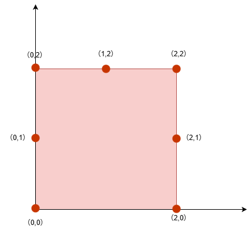
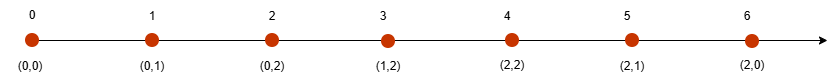

## Approach: Binary Search

### Intuition
This problem requires selecting k points on the boundary of a square such that the minimum distance between any two selected points is maximized. 
The classic maximize the minimum or minimize the maximum problem can generally be attempted using binary search. 
Since the k points are distributed on the square's boundary, and the given range for k is: k≥4, it can be concluded that the minimum Manhattan distance between the selected k points will definitely not exceed side, as analyzed below:

- Assume that when k>4, no matter how the k points are distributed, there will always be two points on the same edge, and the Manhattan distance between these two points on the same edge is definitely less than or equal to side;

- Assume that when k=4, if the k points are exactly at the four vertices of the square, the smallest Manhattan distance equals side; in other cases, there will still be two points on the same edge, and the Manhattan distance between these two points will definitely be less than or equal to side.

In summary, the minimum Manhattan distance between k points will definitely not exceed side.

Calculating the Manhattan distances between all k points seems complicated, but we notice that the problem requires maximizing the minimum Manhattan distance. 
Therefore, we only need to find the minimum Manhattan distance among the k selected points, without calculating all Manhattan distances. 
We observe that the two points with the minimum Manhattan distance in the selected k-point set must be on the same edge or adjacent edges. 
If two points are on opposite edges (left-right or top-bottom), their Manhattan distance will definitely be greater than or equal to side, so we can ignore such cases. 
For convenience in calculation, when searching for the minimum Manhattan distance among k points, we can fold and unfold the square in a clockwise order: left, up, right, down. 

The reason for unfolding the four edges in this order is as follows:

- The answer must not exceed side;
- If two points were originally on the same edge or adjacent edges, their distance after unfolding equals their original Manhattan distance;
- If two points were originally on opposite sides, the distance between them after folding is greater than their original Manhattan distance, but the original Manhattan distance between two points on opposite sides is at least side, which does not affect the answer;

We convert k points into one dimension, where the minimum Manhattan distance must be between two adjacent (considering cyclic) points in the one-dimensional space. This can be proven by contradiction, and the detailed proof is omitted here.

Assume the given side=2, at this time the given k points are: [[0,0],[0,1],[0,2],[1,2],[2,0],[2,2],[2,1]], and the square is divided as follows:

As shown in the above figure, we can unfold the edges of a square in a clockwise order: left, top, right, and bottom, mapping the points on the two-dimensional square boundary to a one-dimensional number axis. 

The unfolding rules are as follows:

- On the left (x=0), distance = y;
- Top side (y=side): distance = side+x;
- Right side (x=side): distance = 3⋅side−y;
- Below (y=0): Distance = 4⋅side−x;

As follows after expansion:

The one-dimensional coordinate after expanding the upper figure is: [0,1,2,3,4,5,6]. 
If we convert all the points into one dimension, assuming the given distance is x, the problem becomes:

- Can we select k numbers from a one-dimensional array arr such that any two adjacent elements differ by at least x, and the difference between the last and first numbers is at most side⋅4−x;

- The difference side⋅4−x is because arr is a circular array, with the first element of the array denoted as a and the last element as b. For the first element a, b in the circular array can be considered as b−side⋅4 in the negative direction. At this point, the requirement is a−(b−side⋅4)≥x, leading to b−a≤side⋅4−x.

We use binary search to find the maximum of the minimum distances, with the lower bound of binary search set to 1, and the upper bound can be set to side based on the previous reasoning. 

The actual algorithm process is as follows:

- First, we expand all two-dimensional coordinate points in a clockwise order of left, up, right, and down into a one-dimensional coordinate array arr, and then sort arr based on the one-dimensional coordinate values.

- Then perform a binary search. Assuming the current given distance is limit, the process is as follows: start enumerating elements from the left of the array arr, and continuously perform a binary search to find elements that are at least limit away, i.e., find k elements in the array such that the distance between adjacent elements is greater than or equal to limit. The search stops when reaching the end of the array or when the difference between the first and last element exceeds side⋅4−limit.

This problem requires selecting k points on the boundary of a square such that the minimum distance between any two selected points is maximized. 
This is a classic maximize the minimum (or minimize the maximum) type of problem, which can generally be solved using binary search. 
Since the k points lie on the square's boundary and the constraint is k≥4, we can conclude that the minimum Manhattan distance between the selected points will not exceed side, as explained below:

- When k>4, no matter how the points are distributed, there must exist at least two points on the same edge. The Manhattan distance between two such points is at most side.

- When k=4, if the points lie exactly at the four vertices of the square, the minimum Manhattan distance is side. In all other cases, there will still be at least two points on the same edge, so the distance is at most side.

Therefore, the minimum Manhattan distance among the selected k points cannot exceed side.

At first glance, computing all pairwise Manhattan distances seems complicated.
However, since we only need to maximize the minimum distance, we only need to track the smallest distance among the selected points, rather than computing all distances.

We observe that the pair of points with the minimum Manhattan distance must lie either on the same edge or on adjacent edges. 
If two points lie on opposite edges, their Manhattan distance is at least side, so such pairs do not affect the answer.

To simplify the problem, we can map the square boundary to a one-dimensional array by "unfolding" it in clockwise order: left, top, right, bottom. 

The reasoning is as follows:

- The answer does not exceed side;

- If two points lie on the same or adjacent edges, their distance after unfolding remains equal to their original Manhattan distance;

- If two points lie on opposite edges, their unfolded distance becomes larger than their original distance, but since their original distance is already at least side, this does not affect the final result.

After this transformation, the problem reduces to selecting k points on a circular one-dimensional array such that the minimum distance between adjacent (cyclic) points is maximized. 
This can be formally proven by contradiction, but we omit the proof here.

### Complexity Analysis

Let n be the number of points, k be the given integer, and side be the side length of the square.

- Time complexity: O(nk⋅logside⋅logn).

Sorting takes O(nlogn). Each feasibility check takes O(nklogn), and binary search runs for at most logside iterations. Therefore, the total time complexity is O(nk⋅logside⋅logn).

- Space complexity: O(n).

We use an additional array to store the transformed coordinates.
