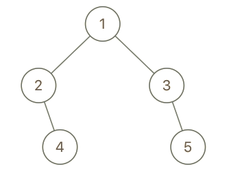

## 993. Cousins in Binary Tree
Given the root of a binary tree with unique values and the values of two different nodes of the tree x and y, return true if the nodes corresponding to the values x and y in the tree are cousins, or false otherwise.

Two nodes of a binary tree are cousins if they have the same depth with different parents.

Note that in a binary tree, the root node is at the depth 0, and children of each depth k node are at the depth k + 1.

### Example 1:

> Input: root = [1,2,3,4], x = 4, y = 3 
> Output: false

### Example 2:

> Input: root = [1,2,3,null,4,null,5], x = 5, y = 4 
> Output: true

### Example 3:

> Input: root = [1,2,3,null,4], x = 2, y = 3 
> Output: false

### Constraints:

- The number of nodes in the tree is in the range [2, 100].
- 1 <= Node.val <= 100
- Each node has a unique value.
- x != y
- x and y are exist in the tree.

### Topics

- Tree
- Depth-First Search
- Breadth-First Search
- Binary Tree

###

BFS로 풀면 depth 같게 루프 돌 수 있음